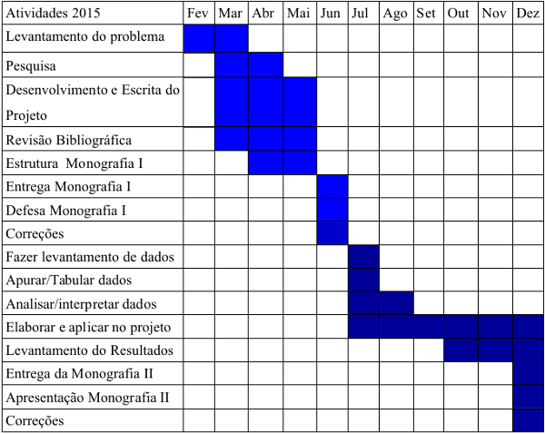

Mapeamento apresentação
=======================

Introdução
----------

- Avanço tecnológico e importância do software para as pessoas;
> Hoje devido ao avanço tecnológicos, softwares e aplicações tem se tornado muito importante para pessoas hoje. Então o Desenvolvimento precisa ser de qualidade e estável

- Surgimento dos Métodos Ágeis;
> Para isso surgiu os métodos ágeis, por que os atuais prazos longos hoje se torna inviável

- Divisão das responsabilidade;
> Mas isso acabou criando divisões de responsabilidades. Divisão de quem desenvolve de quem mantêm o software funcionando

Problemas
---------

- Muitas demandas para um curto espaço de tempo;
> Hoje pela sociedade utilizar muitos meios digitais, cria-se muita demanda e exigências o mais rápido possível

- Processo dos setores de TI com conceitos de sistemas estáticos;
> Os atuais processo e modelos de TI de acumular mudanças para liberação não tem mais espaço e já tem sinais de esgotamento

- Área de desenvolvimento e infraestrutura trabalhando separadamente;
> Dificulta a comunicação e entendimento de ambas as partes, onde causam conflitos na hora de implantar novas funcionalidades da aplicação

- Ambientes de desenvolvimento diferentes do ambiente de produção;
> Isso acaba dificultando você fazer uma liberação de software de maneira segura

- Mal monitoramento da aplicação;
> Não saber como sua aplicação esta se comportando diante do usuário

Hipóteses e Questões de Pesquisa 
--------------------------------

- Por que existe diferenças entre ambiente de desenvolvimento e produção?
- Por que o desenvolvimento e infraestrutura trabalham tão distantes?
- É possível utilizar a cultura DevOps para melhorar os processos de
desenvolvimento de software no CRS (Centro de Residência em Software) -
Unochapecó?
- Implantar a cultura DevOps no CRS - Unochapecó, traz resultados rapidamente?
- Que ganhos e benefícios trará?

Objetivos
---------

**Objetivo Geral**

"Fazer um levantamento sobre tecnologias e práticas que utilizam os conceitos do
DevOps, analisar às melhorias que o DevOps pode trazer para o ambiente de desenvolvimento
de software e aplicá-la em uma situação real, para verificar se a abordagem realmente traz
benefícios aos envolvidos no processo de desenvolvimento de software."

**Objetivos Específicos**

- Conhecer os processos do desenvolvimento de software.
- Entender conceitos da metodologia que se aplicam ao ambiente DevOps.
- Melhorar o ambiente de desenvolvimento e monitoramento da aplicação através
do uso cultura do DevOps.
- Aplicar uma proposta em um ambiente desenvolvimento real (CRS –
Unochapecó), utilizando conceitos e práticas do DevOps.
- Analisar o comportamento, vantagens e desvantagens que a proposta traz ao
ambiente de desenvolvimento.

> Para se dizer o por que de utilizar o DevOps

Justificativa
-------------

> Devido aos problemas citados

- Entregar software em produção cada vez mais difícil; 

- Métodos ágeis de desenvolvimento não alcançaram todo valor da aplicação;

- Medos de mudanças;
(hoje existe um grande medo de mudanças por parte das equipes de operações e esse medo acaba criando processo caro e burocrático para
gestão de mudanças, os processos longos para atualizar versões das aplicações ou mesmo corrigir erros)

- Liberações de versões (deploy) arriscadas
(o que acontece muito é desenvolvedores não sabem como os códigos se comportam no ambiente de produção)

- “Funciona na minha máquina”
(problemas que acontecem só na produção e nas maquinas dos desenvolvedores não, devido a diferença entre os ambientes)

- Surgimento de Silos
(empresas de TI geralmente são divididas em equipes, cada qual com suas funcionalidade sem haver comunicação entre elas)

Revisão bibliográfica
---------------------

Ambientes de Desenvolvimento de Software
----------------------------------------

- Ambientes de Desenvolvimento
- Ambientes de Produção
- Ambientes de Operações

**Ambientes de Desenvolvimento**

Necessário para a equipe de desenvolvimento desenvolver  o software
Envolve um coleção de ferramentas
- Sistema Operacional
- Linguagem de Programação
- IDE (ambiente de desenvolvimento integrado)
- Controle de Versão

**Ambientes de Produção**

Processo de execução de produto, onde os usuário terão acesso ao software desenvolvimento
Mantêm sempre um grau de complexidade alto
- Gerenciamento de dependências
(conforme cresce as a aplicação, aumenta o numero de pacotes e dependências)

- Arquivos de configurações
(onde é guardadas informações, tipos de maquina, aplicação, segurança)

- Versões diferentes 
(saber qual versão está sendo usada se torna difícil)

**Ambientes de Operações**

Necessário para a equipe de infraestrutura manter o software funcionando
Processos envolvidos
- Instalação/Configuração de servidores
- Build(processo de compilação, teste e
empacotamento da aplicação) e Deploy(liberação de versões) da aplicação 
obs:deploy levar o código desenvolvido pra produção 

Monitoramento da Aplicação
--------------------------

É observar, analisar e manter o acompanhamento de como a aplicação está se comportando. 

(e ficando atento aos possíveis sinais de que algo não está normal)

Pontos que o monitoramento deve ganhar atenção:
- Notificações
(um bom monitoramento deve alertá-lo quando algo estiver errado)

- Agregação de logs
(coleta informações/mensagem geralmente de erros)

- Métricas
(você medir aplicações, processos, negócios e até pessoas)

- Visualizações
(utilizar um ferramenta para poder sintetizar a grande quantidade de informação)

- Informações em tempo de execução
(saber como o usuário está utilizando a aplicação, quando feito consultas no banco de dados)

- Disponibilidade
(saber quando algo esta indisponível para o usuário)

Segundo um pesquisa da Aberdeen:

- As empresas podem antecipar em 53% de problemas nas aplicações antes de receber uma reclamação
- Melhoria de 48% no tempo de correções de falhas no desempenho
- Redução de 15% no número total de reclamações dos usuários

Equipes
-------

- Equipes de Desenvolvimento
- Equipes de Operações

**Equipes de Desenvolvimento**

Responsável por desenvolver novos produtos ou funcionalidades e dar manutenção
para possíveis problemas que ocorram no software.
Dentre as principais responsabilidade são:
- Design do software
- Protótipo
- Programação
- Testes
- Validação

**Equipes de Operações**
 
Responsáveis por manter os sistemas funcionando, monitorando o funcionamento, a
performance, avaliando e propor melhorias.
Principais responsabilidades:
- Gestão de ambiente de teste
(garantir que erros não apareçam em ambientes de produção)

- Gestão de error e incidentes
(gerenciar e resolver os problemas de forma rápida e segura)

- Feedback Continuo
(manter as equipes envolvidas atualizadas sobre o que está acontecendo nos processos)

**Problemas entre as Equipes**

Alguns fatores que geram estes conflitos entre as equipes

- Surgimento de metodologia para desenvolvimento ágil para equipes de Desenvolvimento;
(por que os desenvolvedores criando software mais rápidos e as equipes de operações mantêm regras rígidas)

- Demora em fazer Deploys para a produção;
(processo burogratios de mudanças)

- Falta de FeedBack aos desenvolvedores sobre suas implementações;
(demora na comunicação entre as equipes, causa perca de tempo)

- Ambiente dos desenvolvedores diferente do ambiente de produção;

- Equipe de operações com culturas arcaicas de administração;
(mantêm distancia dos desenvolvedores, liberações demoradas)

DevOps
------

**Introdução**

O movimento/cultura DevOps foca em aperfeiçoamento da comunicação, colaboração e integração entre desenvolvedores de software e
administradores da infraestrutura de TI.

**Como surgiu**

- Por volta de 2008 começa a utilizar o termo infraestrutura ágil
- Em 2009 varias metodologias e pensamentos surgiram
- O termo DevOps foi criado durante a conferência Velocity da O’Reilly, 
onde John Allspaw e Paul Hammond apresentaram o trabalho “10+ Deploys Per Day: Dev and Ops Cooperation at Flickr”
- No final de 2009 na Bélgica aconteceu o primeiro encontro chamado DevOpsDay, criado por Patrick Debois
- Voltado inicialmente pra startups, depois a passando para ambientes corporativos; 
(abordar detalhes de cada uma)

**Conceitos** 

DevOps se mantêm em quatro pilares principais, conhecidos pelas siglas C.A.M.S.
- Cultura
(equipes precisam ser ter colaboração, integração, flexibilidade, mantendo um relação saudável)

- Automação
(é você buscar automatizar o maior número de processos possíveis)

- Medição/Avaliação
(medir tudo que possível, sem medir, não se pode melhorar)

- Compartilhamento
(existir uma boa comunicação entre as equipes, permitir essa troca de ideias e problemas, isso no processo de melhoria continua)
 
**Ferramentas**

- Gerenciamento do Ambiente de Desenvolvimento 
(busca manter ambientes de desenvolvimento e operações iguais[vagrant, docker])

- Gerenciamento de Configurações
(busca manter configurações únicas permitindo o compartilhamento entre maquinas [puppet, chef])

- Gerenciamento das Configurações da Aplicação
(utilizadas para instalação, gerencia e atualização de pacotes ou bibliotecas extras  [composer, Bundler])

- Monitoramento da Aplicação
(permite ver e analisar como sua aplicação está funcionando [new relic, nagios])

Procedimentos metodológicos
---------------------------

- Pesquisa bibliográfica
(a partir de livros, artigos e materiais disponibilizados na Internet)
 
- Faz-se necessária pesquisa de levantamento de dados, através de uma
questionário sobre o atual funcionamento

- Analise e interpretação dos problemas
- Elaborações de etapas
- Relatando os dados conquistados

Cronograma
----------

Orçamento
---------

Nenhum gasto será necessário para este projeto.

Referencias
-----------

4LINUX.
CARVALHO, Guto.
DUVALL, Paul.
LEITE, Jair C.
RELIC, New.
SATO, Danilo.
