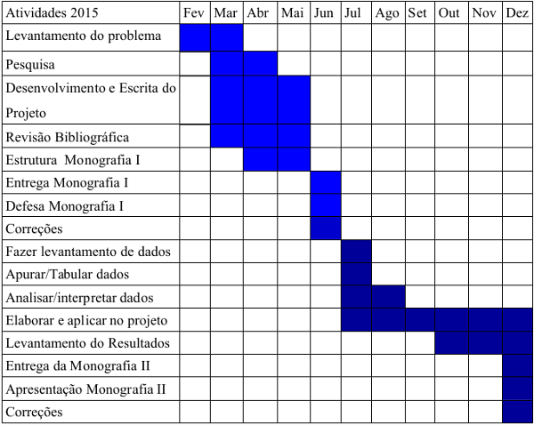

Mapeamento da Apresentação Monografia I
=======================================

Introdução
----------

- Avanço tecnológico e importância do software para as pessoas;
> Hoje devido ao avanço tecnológicos, softwares e aplicações tem se tornado muito importante para as pessoas. Então o Desenvolvimento precisa ser de qualidade e estável.

- Surgimento dos Métodos Ágeis;
> Para isso surgiu os métodos ágeis, por que os atuais prazos longos de entrega, hoje, se torna inviável

- Divisão das responsabilidade;
> Mas isso acabou criando divisões de responsabilidades. Divisão de quem desenvolve de quem mantêm o software funcionando

Problemas
---------

- Muitas demandas para um curto espaço de tempo;
> Pela sociedade utilizar muitos meios digitais, cria-se muita demanda e exigências o mais rápido possível

- Processos dos setores de TI com conceitos de sistemas estáticos;
> Os atuais processo e modelos de TI de acumular mudanças para liberação não tem mais espaço e já tem sinais de esgotamento

- Área de desenvolvimento e infraestrutura trabalhando separadamente;
> Dificulta a comunicação e entendimento de ambas as partes, onde causam conflitos na hora de implantar novas funcionalidades na aplicação

- Ambientes de desenvolvimento diferentes do ambiente de produção;
> Isso acaba dificultando você fazer uma liberação de software de maneira segura

- Mal monitoramento da aplicação;
> Não saber como sua aplicação esta se comportando diante do usuário

Hipóteses e Questões de Pesquisa 
--------------------------------

- Por que existe diferenças entre ambiente de desenvolvimento e produção?
- Por que o desenvolvimento e infraestrutura trabalham tão distantes?
- É possível utilizar a cultura DevOps para melhorar os processos de
desenvolvimento de software no CRS (Centro de Residência em Software) -
Unochapecó?
- Implantar a cultura DevOps no CRS - Unochapecó, traz resultados rapidamente?
- Que ganhos e benefícios trará?

Objetivos
---------

**Objetivo Geral**

"Fazer um levantamento sobre tecnologias e práticas que utilizam os conceitos do
DevOps, analisar às melhorias que o DevOps pode trazer para o ambiente de desenvolvimento
de software e aplicá-la em uma situação real, para verificar se a abordagem realmente traz
benefícios aos envolvidos no processo de desenvolvimento de software."

**Objetivos Específicos**

- Conhecer os processos do desenvolvimento de software;
- Entender conceitos da metodologia que se aplicam ao ambiente DevOps;
- Melhorar o ambiente de desenvolvimento e monitoramento da aplicação através
do uso cultura do DevOps;
- Aplicar uma proposta em um ambiente desenvolvimento real (CRS –
Unochapecó), utilizando conceitos e práticas do DevOps;
- Analisar o comportamento, vantagens e desvantagens que a proposta traz ao
ambiente de desenvolvimento;

> Para se dizer o por que de utilizar o DevOps

Justificativa
-------------

> Devido aos problemas citados

- Entregar software em produção cada vez mais difícil; 

- Métodos ágeis de desenvolvimento não alcançaram todo valor da aplicação;

- Medos de mudanças;
> Equipes de operações geralmente tem muito medo de mudanças, e esse medo acaba criando processos caro e burocrático, onde para atualizar versões ou corrigir erro das aplicações precisa passar por processo longos de gestão.

- Liberações de versões (deploy) arriscadas;
> Acontece muito, é desenvolvedores não saberem como os seus códigos se comportam no ambiente de produção

- “Funciona na minha máquina”;
> Problemas que acontecem só na produção e nas maquinas dos desenvolvedores não, devido as diferencias dos ambientes

- Surgimento de Silos;
> Empresas de TI geralmente são divididas em equipes ou departamentos, cada qual com suas funcionalidade, sem haver comunicação entre elas

Revisão bibliográfica
---------------------

Ambientes de Desenvolvimento de Software
----------------------------------------

- Ambientes de Desenvolvimento;
- Ambientes de Produção;
- Ambientes de Operações;

**Ambientes de Desenvolvimento**

Necessário para a equipe de desenvolvimento desenvolver  o software.
Envolve um coleção de ferramentas:

- Sistema Operacional;
- Linguagem de Programação;
- IDE (ambiente de desenvolvimento integrado);
- Controle de Versão;

**Ambientes de Produção**

Processo de execução de produto, onde os usuários terão acesso ao software desenvolvimento.
Mantêm sempre um grau de complexidade alto.

- Gerenciamento de dependências;
> Conforme cresce a aplicação, aumenta o numero de pacotes e dependências, então você tem que saber gerenciar isso

- Arquivos de configurações;
> Onde é guardadas informações para a aplicação funcionar, tipos de maquina, aplicação, segurança

- Versões diferentes;
> Saber qual a versão está sendo usada e quais funcionalidades o usuário pode usar

**Ambientes de Operações**

Necessário para a equipe de infraestrutura manter o software funcionando
Processos envolvidos:

- Instalação/Configuração de servidores;
- Build e Deploy da aplicação;
> Processo de compilação, teste e empacotamento da aplicação || liberação de versões, levar o código desenvolvido pra produção

> Outro ponto importante e que o DevOps incentiva é o monitoramento da aplicação

Monitoramento da Aplicação
--------------------------

É observar, analisar e manter o acompanhamento de como a aplicação está se comportando. 

Pontos que o monitoramento deve ganhar atenção:

- Notificações;
> Um bom monitoramento deve alertar quando algo estiver errado

- Agregação de logs;
> Coleta de informações/mensagem geralmente de erros

- Métricas;
> Você medir aplicações, processos, negócios e até pessoas

- Visualizações;

- Informações em tempo de execução;
> Saber como o usuário está utilizando a aplicação

- Disponibilidade;
> Saber quando uma funcionalidade está ou não disponível para o usuário

Segundo um pesquisa da Aberdeen:

- As empresas podem antecipar em 53% problemas nas aplicações, antes de receber uma reclamação;
- Melhoria de 48% no tempo de correções nas falhas de desempenho;
- Redução de 15% no número total de reclamações dos usuários;

> Foi falado até aqui sobre ambientes e monitoramento, mas não de quem utiliza tudo isso, que são as equipes

Equipes
-------

- Equipes de Desenvolvimento;
- Equipes de Operações;

**Equipes de Desenvolvimento**

Responsável por desenvolver novos produtos, funcionalidades e dar manutenção para possíveis problemas que ocorram no software.

Dentre as principais responsabilidade são:

- Design do software;
- Protótipo;
- Programação;
- Testes;
- Validação;

**Equipes de Operações**
 
Responsáveis por manter os sistemas funcionando. Monitorando a
performance, avaliando e propondo melhorias.
Principais responsabilidades:

- Gestão de ambiente de teste;
> Garantir que erros não apareçam em ambientes de produção

- Gestão de error e incidentes;
> Gerenciar e resolver os problemas de forma rápida e segura

- Feedback Continuo
> Manter as equipes envolvidas atualizadas sobre o que está acontecendo nos processos

**Problemas entre as Equipes**

Alguns fatores que geram estes conflitos entre as equipes

- Surgimento de metodologia para desenvolvimento ágil para equipes de Desenvolvimento;
> Por que os desenvolvedores criando software mais rápidos e as equipes de operações mantêm regras rígidas e não dão conta da demanda criada

- Demora em fazer Deploys para a produção;
> Por causa dos processo burocráticos de mudanças

- Falta de FeedBack aos desenvolvedores sobre suas implementações;
> Demora na comunicação entre as equipes, causa perca de tempo

- Ambiente dos desenvolvedores diferente do ambiente de produção;
> Dificuldade de você fazer um deploy de maneira segura

- Equipe de operações com culturas arcaicas de administração;
> Ainda tem o costume de ficarem distantes dos desenvolvedores ou mantendo pouca comunicação e ainda mantendo liberações demoradas

> Diante de todos esse problemas enfrentados surgiu o DevOps, que busca solucionar esses problemas

DevOps
------

**Introdução**

O movimento/cultura DevOps foca em aperfeiçoamento da comunicação, colaboração e integração entre desenvolvedores de software e administradores da infraestrutura de TI.

> O DevOps pode ser considerado um movimento cultural que tem objetivo de acabar com essa distancias entre equipes de desenvolvimento e equipes de operações, buscando automatizar ou mais numero possível de processo no desenvolvimento, através de comunicação, colaboração e integração sobre os envolvidos

**Como surgiu**

- Por volta de 2008 começa a utilizar o termo infraestrutura ágil;
- Em 2009 varias metodologias e pensamentos surgiram;
- O termo DevOps foi criado durante a conferência Velocity, foi apresentaram o trabalho “10+ Deploys Per Day: Dev and Ops Cooperation at Flickr”;
- No final de 2009 na Bélgica aconteceu o primeiro encontro chamado DevOpsDay, criado por Patrick Debois;
- Voltado inicialmente pra startups, depois passou a ser aplicado em ambientes corporativos;

> DevOps é mais fácil de aplicar em startups, por que são existe divisões de departamentos e todo mundo trabalham juntos, sem a criação de vícios, já o ambiente corporativo a divisão é clara e existe muita burocracia e vícios, onde que para você solucionar um problema simples você tem que passar por uma processo longo e demorado, onde existe toda uma gestão de mudanças, similar ao ambiente que será aplicado

**Conceitos** 

DevOps se mantêm em quatro pilares principais, conhecidos pelas siglas C.A.M.S.

- Cultura;
> É você tornar equipes multidisciplinares e proativas, com colaboração, integração e flexibilidade dos envolvidos, mantendo sempre uma relação saudável e com pessoas motivadas

- Automação;
> É você buscar automatizar o maior número de processos possíveis

- Medição/Avaliação;
> Medir tudo que possível, para poder melhorar

- Compartilhamento;
> Incentivar a comunicação entre as equipes, permitir que exista a troca de ideias e problemas, para existir uma melhoria continua
 
**Ferramentas**

- Gerenciamento do Ambiente de Desenvolvimento 
> Busca manter ambientes de desenvolvimento e operações iguais[vagrant, docker]

&nbsp;
&nbsp;

- Gerenciamento das Configurações da Aplicação;
> Utilizadas para instalação, gerencia e atualização de pacotes ou bibliotecas extras

- Gerenciamento de Configurações;
> Busca manter configurações únicas permitindo o compartilhamento entre maquinas

- Monitoramento da Aplicação;
> Permite ver e analisar como sua aplicação está funcionando

Procedimentos metodológicos
---------------------------

- Pesquisa bibliográfica;
> A partir de livros, artigos e materiais disponibilizados na Internet
 
- Pesquisa de levantamento de dados, através de uma
questionário sobre o atual funcionamento;

- Analise e interpretação dos problemas;
- Elaborações de etapas;
- Relatando os dados conquistados;

Cronograma
----------

Orçamento
---------

Nenhum gasto será necessário para este projeto.

Referências
-----------

- **4LINUX.**
- **CARVALHO, Guto.**
- **DUVALL, Paul.**
- **LEITE, Jair C.**
- **RELIC, New.**
- **SATO, Danilo.**
