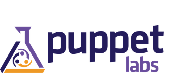

Mapeamento da Apresentação Monografia II
========================================

Introdução
----------

- Avanço tecnológico e importância do software para as pessoas;
> Hoje devido ao avanço tecnológicos, softwares e aplicações tem se tornado muito importante para as pessoas.

- Surgimento dos Métodos Ágeis;

- Divisão das responsabilidade;
> Devido a alta demanda, surgiram o métodos ágeis para entrega o software, mas isso acabou gerando divisões de áreas e responsabilidades.

Objetivos
---------

**Objetivo Geral**

"Levantar ferramentas e práticas que utilizam os conceitos do DevOps, analisar às melhorias que o DevOps pode trazer para o ambiente de desenvolvimento de software e aplicá-la no Centro de Residência em Software, para verificar se a abordagem realmente traz benefícios aos envolvidos no processo de desenvolvimento de software."

**Objetivos Específicos**

- Conhecer os processos do desenvolvimento de software;
- Entender conceitos da metodologia que se aplicam ao ambiente DevOps;
- Melhorar o ambiente de desenvolvimento e monitoramento da aplicação através da cultura do DevOps;
- Aplicar uma proposta em um ambiente desenvolvimento real (CRS e DTI da Unochapecó), utilizando conceitos e práticas do DevOps;
- Analisar o comportamento, vantagens e desvantagens que a proposta traz ao ambiente de desenvolvimento;

Justificativa
-------------

- Entregar software em produção cada vez mais difícil; 
> Devido a vários fatores envolvidos.

- Métodos ágeis de desenvolvimento não alcançaram todo valor da aplicação;
> Equipe de operações não participa.

- Medos de mudanças e liberações de versões (deploy) arriscadas;
> Equipes de operações geralmente não tem certeza de que liberação não possue nenhum erro.

- Surgimento de Silos;
> Empresas de TI geralmente são divididas em equipes ou departamentos, cada qual com suas funcionalidade, sem haver comunicação entre elas.

Ambientes de Desenvolvimento de Software
----------------------------------------

- Ambientes de Desenvolvimento;
- Ambientes de Produção;
- Ambientes de Operações;

**Ambientes de Desenvolvimento**

Necessário para a equipe de desenvolvimento desenvolver  o software.
Envolve um coleção de ferramentas:

- Sistema Operacional;
- Linguagem de Programação;
- IDE (ambiente de desenvolvimento integrado);
- Controle de Versão;

**Ambientes de Produção**

Processo de execução de produto, onde os usuários terão acesso ao software desenvolvimento.
Mantêm sempre um grau de complexidade alto.

- Gerenciamento de dependências;
- Arquivos de configurações;
- Versões diferentes;

**Ambientes de Operações**

Necessário para a equipe de infraestrutura manter o software funcionando
Processos envolvidos:

- Instalação/Configuração de servidores;
- Build e Deploy da aplicação;
> Processo de compilação, teste e empacotamento da aplicação.

Monitoramento da Aplicação
--------------------------

É observar, analisar e manter o acompanhamento de como a aplicação está se comportando. 

Pontos que o monitoramento deve ganhar atenção:

- Notificações;
- Agregação de logs;
- Métricas, visualizações;
- Informações em tempo de execução;
- Disponibilidade;

Equipes
-------

- Equipes de Desenvolvimento;
- Equipes de Operações;

**Equipes de Desenvolvimento**

Responsável por desenvolver novos produtos, funcionalidades e dar manutenção para possíveis problemas que ocorram no software.

Dentre as principais responsabilidade são:

- Design do software;
- Protótipo;
- Programação;
- Testes;
- Validação;

**Equipes de Operações**
 
Responsáveis por manter os sistemas funcionando. Monitorando a
performance, avaliando e propondo melhorias.
Principais responsabilidades:

- Gestão de ambiente de teste;
- Gestão de error e incidentes;
- Feedback Continuo

**Problemas entre as Equipes**

Alguns fatores que geram estes conflitos entre as equipes

- Surgimento de metodologia para desenvolvimento ágil para equipes de Desenvolvimento;
- Demora em fazer Deploys para a produção;
- Falta de FeedBack aos desenvolvedores sobre suas implementações;
- Ambiente dos desenvolvedores diferente do ambiente de produção;
- Equipe de operações com culturas arcaicas de administração;
> Equipes de operações tem o costume de ficar longe dos desenvolvedores e manter liberações demoradas.

DevOps
------

**Introdução**

O movimento/cultura DevOps foca em aperfeiçoamento da comunicação, colaboração e integração entre desenvolvedores de software e administradores da infraestrutura de TI.

> O DevOps pode ser considerado um movimento cultural que tem objetivo de acabar com essa distancias entre equipes de desenvolvimento e equipes de operações, buscando automatizar ou mais numero possível de processo no desenvolvimento, através de comunicação, colaboração e integração sobre os envolvidos

**Como surgiu**

- Por volta de 2008 começa-se a utilizar o termo infraestrutura ágil;
- Em algumas listas de discussão com foco em desenvolvimento ágil, e na mesma época durante evento Agile 2008;
- Entusiasta do assunto era Patrick Debois, criador do DevOpsDay;

**Conceitos** 

DevOps se mantêm em quatro pilares principais, conhecidos pelas siglas C.A.M.S.

- Cultura;
> É você tornar equipes multidisciplinares e proativas, com colaboração, integração e flexibilidade dos envolvidos, mantendo sempre uma relação saudável e com pessoas motivadas

- Automação;
> É você buscar automatizar o maior número de processos possíveis

- Medição/Avaliação;
> Medir tudo que possível, para poder melhorar

- Compartilhamento;
> Incentivar a comunicação entre as equipes, permitir que exista a troca de ideias e problemas, para existir uma melhoria continua
 
**Ferramentas**

- Gerenciamento do Ambiente de Desenvolvimento

> Busca manter ambientes de desenvolvimento e operações iguais[vagrant, docker]

- Gerenciamento das Configurações da Aplicação;

> Utilizadas para instalação, gerencia e atualização de pacotes ou bibliotecas extras

- Gerenciamento de Configurações;

> Busca manter configurações únicas permitindo o compartilhamento entre maquinas

- Monitoramento da Aplicação;

> Permite ver e analisar como sua aplicação está funcionando

Questionário
------------

- Criado pelo Google form;
- 18 perguntas descritivas e de múltiplas escolhas;
- Questões sobre o entendimento e aplicação do DevOps na empresa;
- Aplicado para o CRS e DTI da Unochapecó;
- Aplicado para empresas do Oeste de Santa Catarina;

**Questionário para empresas da região**

- Distribuído para mais de 25 empresas de desenvolvimento onde teve 11 respostas obtidas;
- Pode-se identificar pouco conhecimento das empresas e apresentação de vários problemas que a cultura DevOps poderia auxiliar a resolver;

[imagens]

**Questionário aplicado para CRS e DTI da Unochapecó**

- Reunião/Encontro;

Problemas entre CRS e DTI
-------------------------

- Contato só existe quando abrem-se chamados;
- Equipe de Operações (ops) desconhece metodologias e ferramentas que a equipe de Desenvolvimento (devs) utilizam;
- Equipe de Desenvolvimento (devs) desconhece também o papel da equipe de Operações (ops);
- Diferenças entre ambientes de desenvolvimento e produção;
- Em poucos casos o Devs e Ops decidem os projetos juntos;
- Monitoramento da aplicação não é feito;

Aplicação dos Conceitos
-----------------------

- Apresentação dos conceitos da cultura do DevOps entre os envolvidos;
- Utilização de uma ferramenta de monitoramento (New Relic);
- Utilização de uma ferramenta para padronização dos ambientes (Docker);

**Apresentação dos Conceitos**

- Primeiro documento, material sobre o DevOps;
- Segundo documento, tutorial sobre a ferramenta New Relic;
- Terceiro documento, tutorial sobre a ferramenta Docker;
- Encontro/reunião entre o acadêmico, equipes de operações e desenvolvimento;

**Ferramentas**

- New Relic;
- Docker;

**New Relic**

- New Relic foi fundada em 2008;
- 250 mil usuários;
- 4 mil aplicações monitoradas por dia;
- Vários tipos de produtos (mobile, browser e servers);
- Sistema monitorado através do New Relic foi infohab.org.br;
- Tem como características realizar muitas consultas no banco de dados;
- Transações web dos últimos 30 minutos;

**New Relic Recursos**

[imagens]

**New Relic Ganhos**

- Oferece vários recursos úteis para os desenvolvedores;
- Pontos críticos da aplicação;
- Satisfação dos usuários;
- Aplicação mais estável;

**Docker**

- Open source (código aberto) sem nenhum custo;
- Solicitação de um relatório das versões dos ambientes de desenvolvimento e produção;
- Criação de um máquina para utilização no ambiente de desenvolvimento e no ambiente de produção;

[imagens]

**Docker Ganhos

- Fácil utilização e distribuição;
- Muito utilizado atualmente por devs/ops;
- Permitiu manter ambientes do CRS e DTI iguais;

Resultados
----------

- Vantagens;
- Desvantagens;

**Vantagens**

- Conhecimento de novos conceitos e ferramentas do DevOps;
- Melhor acompanhamento das aplicações através da ferramenta de monitoramento New Relic;
- Padronização dos ambientes de desenvolvimento e produção;
- Diminuição das diferenças entre os ambientes de desenvolvimento e produção;
- Diminuição da distância entre equipe de desenvolvedores (CRS) e equipe de operações (DTI da Unochapecó);

**Desvantagens**

- Tempo gasto para aprender e utilizar ferramentas;
- Tempo para assimilar novos conceitos;
- Processos burocráticos da Instituição;

Conclusões
----------

- Itens importantes foram aplicados;
- Divulgação do DevOps na região do Oeste de Santa Catarina (através do questionário);
- DevOps é um tema atual utilizado por várias empresas de grande porte;
- O DevOps para meios corporativos é necessário muita motivação;

Trabalhos futuros
-----------------

Para trabalhos futuros sugere-se aplicar novos itens no CRS e DTI da Unochapecó ou empresas que desconheçam o DevOps:

- Automatizar e facilitar processo de Deploy da aplicação;
- Gerenciamento de logs;
- Ferramentas para centralização das configurações (Chef e Puppet);
- Análise entre a aplicação do DevOps para meios corporativos e startups;

Referências
-----------

- **CARVALHO, Guto.**
- **RELIC, New.**
- **SATO, Danilo.**
